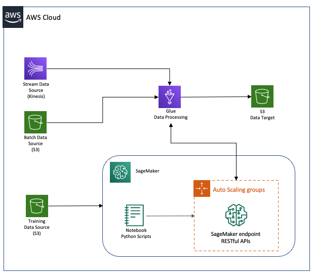

# ML-powered near real-time & batch analytics pipelines on AWS

In this repo, I will show readers step by step about how to host a machine learning model on a SageMaker endpoint, then create batch and near real-time streaming Glue jobs to invoke the machine learning model to generate prediction data along with the original input data, and finally save all the data into a S3 bucket. The following diagram illustrates the architecture of the solution.



The following sections will walk through the steps about AWS services setup. 

## Prerequisites
For this walkthrough, you should have the following prerequisites: 

- An [AWS account](https://signin.aws.amazon.com/signin?redirect_uri=https%3A%2F%2Fportal.aws.amazon.com%2Fbilling%2Fsignup%2Fresume&client_id=signup) and the user setup with `AdministratorAccess` permission. For how to create an admin IAM user, please refer to this [AWS on-line document](https://docs.aws.amazon.com/mediapackage/latest/ug/setting-up-create-iam-user.html).
- AWS resources of [Glue](https://aws.amazon.com/glue/), [Kinesis](https://aws.amazon.com/kinesis/) and [SageMaker](https://aws.amazon.com/sagemaker/) services
- Basic knowledge on running Python codes on a Jupyter notebook
- Basic knowledge on setting IAM users and roles

## Walkthrough

### Create an IAM role
First of all, you need to setup an IAM role with proper permission policies to allow Glue service to communicate with Kinesis and SageMaker services.

1. Open the [AWS IAM console](https://console.aws.amazon.com/iam/).
2. Click on the Roles option on the left and then click on `Create role` button.


3. Choose `AWS service` for trusted entity type and then choose `Glue` for use cases. Click `Next: Permissions` button.
4. Search and then choose the following policies: `AWSGlueServiceRole`, `AmazonKinesisFullAccess`, `AmazonSageMakerFullAccess`. Click `Next: Tags` button. Then click `Next: Review` button.
5. Give the `Role name` as `AWSGlueServiceRole-s3-kinesis-sagemaker` and then click `Create role` button. After this step, you should see the role setup like the screen shot below:


### Create a Machine Learning Model
You will use SageMaker Studio to build a machine learning model and deploy it on an endpoint. The on-line AWS documentation for onboarding SageMaker studio using Quick Start can be found [here](https://docs.aws.amazon.com/sagemaker/latest/dg/onboard-quick-start.html).

#### To onboard to Studio using Quick start

1.	Open the [SageMaker console](https://console.aws.amazon.com/sagemaker/).
2.	Choose `US East (N. Virginia) us-east-1` region.
3.	Choose `Amazon SageMaker` Studio at the top left of the page.
4.	On the `SageMaker Studio` page, under `Get started`, choose `Quick start`.
5.	For `Username`, type `default-glue-sagemaker`.
6.	For `Execution role`, choose `Create a new role`, the `Create an IAM role` dialog opens, like the screen shot below:


Here, you need to
 - Keep default option on `Any S3 bucket`.
 - Click `Create role` button. SageMaker will create a new IAM `AmazonSageMaker-ExecutionPolicy` role with the `AmazonSageMakerFullAccess` and `AmazonKinesisFullAccess` policies attached, which is similar to the screen shot below.


7.	Click Submit button. 
Note: If you receive an error message that you need to create a VPC, see [Choose a VPC](https://docs.aws.amazon.com/sagemaker/latest/dg/onboard-vpc.html).
On the SageMaker Studio Control Panel, under `Studio Summary`, wait for Status to change to `Ready`.


When Status is Ready, the username `default-glue-sagemaker `is enabled and chosen. Choose `Open Studio`. The Amazon SageMaker Studio loading page displays.

#### To clone a repo to create & deploy a ML model on a Sagemaker endpoint

1.	In the left sidebar of SageMaker Studio webpage (shown above), choose the `File Browser` icon ().
2.	Choose the root folder or the folder you want to clone the repo into.
3.	In the left sidebar, choose the `Git` icon ().


4.	Choose `Clone a Repository`.


5.	Enter the URI for the Github repo `https://github.com/chen115y/Glue-sagemaker.git`.
6.	Choose `CLONE`.
7.	Wait for the download to finish. After the repo has been cloned, the `File Browser` opens to display the cloned repo.
8.	Double click the jupyter notebook `xgboost_customer_churn.ipynb` and run all cells on it.
9.	If all cells run successfully without any errors, you should see a SageMaker endpoint `sagemaker-glue-blog-xgboost-churn` is in the `InService` status like following screen shot.


Here the jupyter notebook describe using machine learning (ML) for the automated identification of unhappy customers, also known as customer churn prediction. It contains the codes for training data preparation, model training and model deployment on SageMaker. The ML algorithm used in this jupyter notebook is XGBoost. 

__Note: after the jupyter notebook has been executed, the chunr.txt data file has been uploaded to the S3 bucket, which follows the pattern of “s3://sagemaker-us-east-1-_AWS account number_/sagemaker/DEMO-xgboost-churn/churndata/churn.txt”.  The _AWS account number_ in this pattern is a 12-digit number account Id and can be found at the [Account Settings](https://console.aws.amazon.com/billing/home?#/account) page.__

### Create a Glue Spark Batch Job to Invoke the ML Model
In this section, you will create a Spark job in Glue, which will read input data from a S3 bucket, invoke the SageMaker ML model endpoint to generate the predictions, combine the original input data and the predictions together and then write them to a S3 bucket in csv format.

1.	Open the [AWS Glue console](https://console.aws.amazon.com/glue/).
2.	Make sure you choose `US East (N. Virginia) us-east-1` region.
3.	Click on the Jobs option on the left and then click on `Add job` button.


4.	Give the name for your job as `glue-sagemaker-batch-job`, 
5.	For IAM role, choose `AWSGlueServiceRole-s3-kinesis-sagemaker` from the dropdown list. 
6.	For This job runs, choose `A new script to be authored by you`. Like the screen shot below. And then click `Next` button.


7.	Click `Save job and edit script` button. On the glue script edit screen, copy and paste the following Python script.

```python
import sys
from awsglue.transforms import *
from awsglue.utils import getResolvedOptions
from awsglue.context import GlueContext
from awsglue.job import Job
from awsglue.dynamicframe import DynamicFrame
import boto3
from pyspark.context import SparkContext
from pyspark.sql.functions import col, udf, struct
from pyspark.sql.types import *

## @params: [JOB_NAME]
args = getResolvedOptions(sys.argv, ['JOB_NAME'])

sc = SparkContext()
glueContext = GlueContext(sc)
spark = glueContext.spark_session
job = Job(glueContext)
job.init(args['JOB_NAME'], args)

# get job parameter values
region = 'us-east-1'
s3_target = 's3://sagemaker-us-east-1-<<AWS account number>>/sagemaker/DEMO-xgboost-churn/result/'
s3_source = 's3://sagemaker-us-east-1-<<AWS account number>>/sagemaker/DEMO-xgboost-churn/churndata/churn.txt'
endpoint_name = 'sagemaker-glue-blog-xgboost-churn'

# read data from source
df = spark.read.option("header", True).csv(s3_source)
df = df.drop('Phone','Day Charge', 'Eve Charge', 'Night Charge', 'Intl Charge', 'Churn?') \
       .select('State','Account Length','Area Code',"Int'l Plan","VMail Plan","VMail Message","Day Mins","Day Calls","Eve Mins","Eve Calls","Night Mins","Night Calls","Intl Mins","Intl Calls","CustServ Calls")
# df.printSchema()

def OneHot_Encoding(column_name, tmp):
    categories = tmp.select(column_name).distinct().rdd.flatMap(lambda x : x).collect()
    categories.sort()
    for category in categories:
        function = udf(lambda item: 1 if item == category else 0, IntegerType())
        new_column_name = column_name + '_' + category
        tmp = tmp.withColumn(new_column_name, function(col(column_name)))
    tmp = tmp.drop(column_name)
    return tmp

df = OneHot_Encoding("State", df)
df = OneHot_Encoding("Int'l Plan", df)
df = OneHot_Encoding("VMail Plan", df)

def get_prediction(row):
    infer_data = ','.join([str(elem) for elem in list(row)])
    runtime_client = boto3.client('runtime.sagemaker', region)
    response = runtime_client.invoke_endpoint(EndpointName=endpoint_name, ContentType="text/csv", Body=infer_data)
    result = response["Body"].read()
    result = result.decode("utf-8")
    return int(float(result) > 0.5)

pred_udf = udf(lambda x: get_prediction(x) if x is not None else None, IntegerType())
df_result = df.withColumn("prediction", pred_udf(struct([df[x] for x in df.columns])))

applymapping1 = DynamicFrame.fromDF(df_result, glueContext, 'applymapping1')
datasink2 = glueContext.write_dynamic_frame.from_options(frame = applymapping1, connection_type = "s3", connection_options = {"path": s3_target}, format = "csv", transformation_ctx = "datasink2")

job.commit()

```

__Note: for the codes, you need to replace all occurrences of "<< AWS account number >>" with your 12-digit AWS account Id, which can be found at the [Account Settings](https://console.aws.amazon.com/billing/home?#/account) page.__

The Glue job codes above will do some one-hot encoding transformation on the data set first. Then it is defining a function called `get_prediction` to invoke the Sagemaker ML endpoint to do the real-time prediction and a [Spark User Defined Function (UDF)](https://spark.apache.org/docs/latest/sql-ref-functions-udf-scalar.html) to leverage the `get_prediction` function on data transformation. The UDF applies on each row of data and adds the prediction result as additional column called “prediction” as codes shown below.


8.	Click Save button to save the job and then click `Run job` button. It should open up the window below. Here, you can provide additional configurations for the job. You can pass Tags, update different monitoring options, provide library path or configure worker type and resource size. For this exercise, leave all options as default and click on `Run job` button.


9.	When the job is running, you will notice that the Run job button is grayed out with a circular-spinner icon.


10.	Exit from the script window. You can monitor additional job metrics by going back to the Glue job console and select the individual job.


11.	`Run status` column shows job status. This Spark job may take about 3 minutes. Once the job is completed successfully, it will show up Succeed status.


12.	If the job is finished successfully, it should have created csv output in the target location, which is something like 's3://sagemaker-us-east-1-_AWS account number_/sagemaker/DEMO-xgboost-churn/result/’. Open up the S3 console and check the target location. The location should be populated with a csv file as displayed below. 


If you crawl the data file via [Glue Crawler](https://docs.aws.amazon.com/glue/latest/dg/add-crawler.html) and/or use [Athena](https://docs.aws.amazon.com/athena/latest/ug/getting-started.html) to query the data, you should see the prediction column as displayed below.


### Glue Spark Streaming Job for Real-time Data Processing

In this section, you will create a Spark streaming job in Glue, which will read input data from a Kinesis data stream, invoke the SageMaker ML model endpoint to generate the predictions, combine the original input data and the predictions together and then write them to a S3 bucket in csv format.

#### Kinesis Stream data

First of all, you need to create a Kinesis data stream and then ingest the churn data into it so that the Glue job can read the data from the Kinesis. This can be done by running the notebook `kinesis-put-get-records.ipynb`.

1.	In order to run the notebook, you need to grant SageMaker permissions to access Kinesis data stream. Go to SageMaker Studio, find the Execution role on Control Panel as shown below.


2.	Open the [AWS IAM console](https://console.aws.amazon.com/iam/).
3.	Click on the `Roles` option on the left and then search the IAM role that you found on the SageMaker Studio Control Panel.


4.	Click the role and click Attach policies.
5.	Search and then choose the following policy: `AmazonKinesisFullAccess`. Click `Attach policy` button. After this step, you should see the role setup like the screen shot below:


6.	After you grant the proper permissions on the IAM role, you need to run the notebook to create the Kinesis data stram and ingest the churn data in it: Go back to SageMaker Studio, `Open Studio` for the user `default-glue-sagemaker`.
7.	Go to the repo folder `Glue-sagemaker`, double click the notebook `kinesis-put-get-records.ipynb` as shown below.


8.	For `Select Kernel`, please choose `Python 3 (Data Science)` from the dropdown list. 


9.	Run all cells. If there are no error, the Kinesis data stream has been successfully created and ingested the churn data already. If you go to Kinesis console, you should see an active Kinesis data stream as shown below.


#### Create data source table on Glue Data Catalog for Kinesis real-time data

In order to let a Glue Spark steam job to get data from Kinesis, you need to set up the data source table on Glue Data Catalog for Kinesis.
1.	Open the [AWS Glue console](https://console.aws.amazon.com/glue/).
2.	Make sure you choose `US East (N. Virginia) us-east-1` region.
3.	Click on the `Tables` option on the left and then click on `Add tables` button to choose `Add table manually`.


 - For `Table name`, type `kinesis_customer_churn`. Choose or create `default` for `Database` as shown below. And then click `Next` button.

 

 - Choose `Kinesis` on Select the type of source. Choose `Stream in my account` on Select a kinesis data stream. Choose `us-east-1` for region and choose `customer_churn_stream` on Kinesis stream name dropdown list. After that you should see the same webpage as shown below. Then click `Next` button.


 - Choose `JSON` for Classification and then click `Next` button.
 - In the `Define a schema` page, add columns as shown below.


 - You don’t need to add partition indices, so click `Next` button and click `Finish` button in the next page.
 - After creating the Kinesis source table `kinesis_customer_churn`, you should see the following page when you click the table name.


#### Glue Spark streaming job
After a Kinesis data stream and corresponding data source table are created, you will need to create a Glue Spark streaming job to process Kinesis data with the SageMaker ML endpoint. 

1.	Open the [AWS Glue console](https://console.aws.amazon.com/glue/).
2.	Make sure you choose `US East (N. Virginia) us-east-1` region.
3.	Click on the `Jobs` option on the left and then click on `Add job` button.


4.	Give the name for your job as `glue-sagemaker-streaming-job`, 
5.	For IAM role, choose `AWSGlueServiceRole-s3-kinesis-sagemaker` from the dropdown list. 
6.	For (job) Type, choose `Spark Streaming` from the dropdown list.
7.	For This job runs, choose` A new script to be authored by you`, like the screen shot below. And then click `Next` button.


8.	Click `Save job and edit script` button. On the glue script edit screen, copy and paste the following Python script.

```python
import sys
from awsglue.transforms import *
from awsglue.utils import getResolvedOptions
from pyspark.context import SparkContext
from awsglue.context import GlueContext
from awsglue.job import Job
from pyspark.sql import DataFrame, Row
from pyspark.sql.functions import col, udf, struct
from pyspark.sql.types import *
import datetime
from awsglue import DynamicFrame
import numpy as np
import boto3

## @params: [JOB_NAME]
args = getResolvedOptions(sys.argv, ['JOB_NAME'])

sc = SparkContext()
glueContext = GlueContext(sc)
spark = glueContext.spark_session
job = Job(glueContext)
job.init(args['JOB_NAME'], args)

## The main process start here ##
endpoint_name = "sagemaker-glue-blog-xgboost-churn"

## Define the One-hot encoding method
def OneHot_Encoding(column_name, tmp):
    categories = tmp.select(column_name).distinct().rdd.flatMap(lambda x : x).collect()
    categories.sort()
    for category in categories:
        function = udf(lambda item: 1 if item == category else 0, IntegerType())
        new_column_name = column_name + '_' + str(category)
        tmp = tmp.withColumn(new_column_name, function(col(column_name)))
    tmp = tmp.drop(column_name)
    return tmp

## Define inference/prediction method via invoking sagemaker endpoint
def get_prediction(row):
    infer_data = ','.join([str(elem) for elem in list(row)])
    sagemaker_client = boto3.client('runtime.sagemaker', 'us-east-1')
    response = sagemaker_client.invoke_endpoint(EndpointName=endpoint_name, ContentType="text/csv", Body=infer_data)
    result = response["Body"].read()
    result = result.decode("utf-8")
    return int(float(result) > 0.5)
pred_udf = udf(lambda x: get_prediction(x) if x is not None else None, IntegerType())

## @type: DataSource
## @args: [stream_type = kinesis, stream_batch_time = "100 seconds", database = "default", additionalOptions = {"startingPosition": "TRIM_HORIZON", "inferSchema": "false"}, stream_checkpoint_location = "s3://sagemaker-us-east-1-684423739646/sagemaker/DEMO-xgboost-churn/result-stream/checkpoint/", table_name = "kinesis_customer_churn"]
## @return: datasource0
## @inputs: []
data_frame_datasource0 = glueContext.create_data_frame.from_catalog(database = "default", table_name = "kinesis_customer_churn", transformation_ctx = "datasource0", additional_options = {"startingPosition": "TRIM_HORIZON", "inferSchema": "true"})
def processBatch(data_frame, batchId):
    if (data_frame.count() > 0):
        datasource0 = DynamicFrame.fromDF(data_frame, glueContext, "from_data_frame")
        # ML transformation to prepare the data for inference/prediction
        df = datasource0.toDF()
        df = df.drop('Phone','Day Charge', 'Eve Charge', 'Night Charge', 'Intl Charge', 'Churn?').select('State','Account Length','Area Code',"Int'l Plan","VMail Plan","VMail Message","Day Mins","Day Calls","Eve Mins","Eve Calls","Night Mins","Night Calls","Intl Mins","Intl Calls","CustServ Calls")
        df = OneHot_Encoding("State", df)
        df = OneHot_Encoding("Int'l Plan", df)
        df = OneHot_Encoding("VMail Plan", df)
        # Invoke SageMaker endpoint to do ML prediction
        df_pred = df.withColumn("prediction", pred_udf(struct([df[x] for x in df.columns])))
        datasource1 = DynamicFrame.fromDF(df_pred, glueContext, "datasource1")
        # Save the final results into s3 bucket
        now = datetime.datetime.now()
        year = now.year
        month = now.month
        day = now.day
        hour = now.hour
        minute = now.minute
        path_datasink1 = "s3://sagemaker-us-east-1-<<AWS Account Number>>/sagemaker/DEMO-xgboost-churn/result-stream" + "/ingest_year=" + "{:0>4}".format(str(year)) + "/ingest_month=" + "{:0>2}".format(str(month)) + "/ingest_day=" + "{:0>2}".format(str(day)) + "/ingest_hour=" + "{:0>2}".format(str(hour)) + "/"
        datasink1 = glueContext.write_dynamic_frame.from_options(frame = datasource1, connection_type = "s3", connection_options = {"path": path_datasink1}, format = "csv", transformation_ctx = "datasink1")
glueContext.forEachBatch(frame = data_frame_datasource0, batch_function = processBatch, options = {"windowSize": "100 seconds", "checkpointLocation": "s3://sagemaker-us-east-1-<<AWS Account Number>>/sagemaker/DEMO-xgboost-churn/result-stream/checkpoint/"})
job.commit()

```

__Note: for the codes, you need to replace all occurrences of << AWS account number >> with your 12-digit AWS account Id, which can be found at the [Account Settings](https://console.aws.amazon.com/billing/home?#/account) page.__

9.	Click the `Save` button to save the job and then click `Run job` button. It should open up the window below. For this exercise, leave all options as default and click on `Run job` button.


10.	When the job is running, you will notice that the Run job button is grayed out with a circular-spinner icon.


11.	Exit from the script window. You can monitor additional job metrics by going back to the Glue job console and select the individual job.


12.	`Run status column` shows job status, this Spark job may take 3 minutes. Then stop the job.
13.	If the job is running successfully, it should have created csv output in the target location. Open up the S3 console and check the target location, which follows the pattern of 's3://sagemaker-us-east-1-<< AWS account number >>/sagemaker/DEMO-xgboost-churn/result-stream/ingest_year=<< year >>/ingest_month=<< month >>/ingest_day=<< day >>/ingest_hour=<< hour >>/’, like the screen shot displayed below. The data file here should contain the same result data as Glue batch job that you created above.


## Cleaning up

To avoid incurring future charges, delete the resources used in this repo after you are done with steps above.

#### Delete Kinesis Data Stream and SageMaker Endpoint 

You can delete the Kinesis data stream and SageMaker endpoint by running the notebook `Clean-up.ipynb`.
1.	Go to SageMaker Studio, `Open Studio` for the user `default-glue-sagemaker`.
2.	Go to the repo folder `Glue-sagemaker`, double click the notebook `Clean-up.ipynb` as shown below.


3.	For `Select Kernel`, please choose `Python 3 (Data Science)` from the dropdown list. 


4.	Run all cells. If there are no error, the Kinesis data stream and SageMaker endpoint have been deleted.

#### Delete SageMaker Studio Domain (Studio)
For deleting the SageMaker Studio domain, the on-line SageMaker documentation to delete all resources on the SageMaker Studio domain can be found [here](https://docs.aws.amazon.com/sagemaker/latest/dg/gs-studio-delete-domain.html).
__To delete a domain__

1.	Open the [SageMaker console](https://console.aws.amazon.com/sagemaker/).
2.	Choose `Amazon SageMaker Studio` at the top left of the page to open the `Amazon SageMaker Studio Control Panel`.
3.	Repeat the steps below for the all users in the `User Name` list:
 -	Choose the user.
 -	On the `User Details` page, for each non-failed app in the `Apps` list, choose `Delete app`.
 -	On the `Delete app` dialog, choose `Yes, delete app`, type _delete_ in the confirmation field, and then choose `Delete`.
 -	When the `Status` for all apps show as `Deleted`, choose `Delete user`.

__Important__

When a user is deleted, you lose access to the Amazon EFS volume that contains data, including notebooks and other artifacts.

4.	When all users are deleted, choose `Delete Studio`.
5.	On the `Delete Studio` dialog, choose `Yes, delete Studio`, type _delete_ in the confirmation field, and then choose `Delete`.


## Conclusion

In this repo, you saw how to prepare your own ML endpoint running on SageMaker and create Glue batch and real-time streaming jobs to invoke the ML endpoint to add prediction results along with the original input data set. In this way, you enable a capability to build an analytics pipeline with a power of the machine learning (ML) by leveraging AWS Glue jobs and SageMaker ML endpoints. 

Glue is a serverless data integration service on AWS. It is powered by Spark distributed computing framework, which can be also selected in Amazon EMR service. Thus, creating Amazon EMR processes to invoke SageMaker ML endpoints can be similar to the work demonstrated in this repo.

